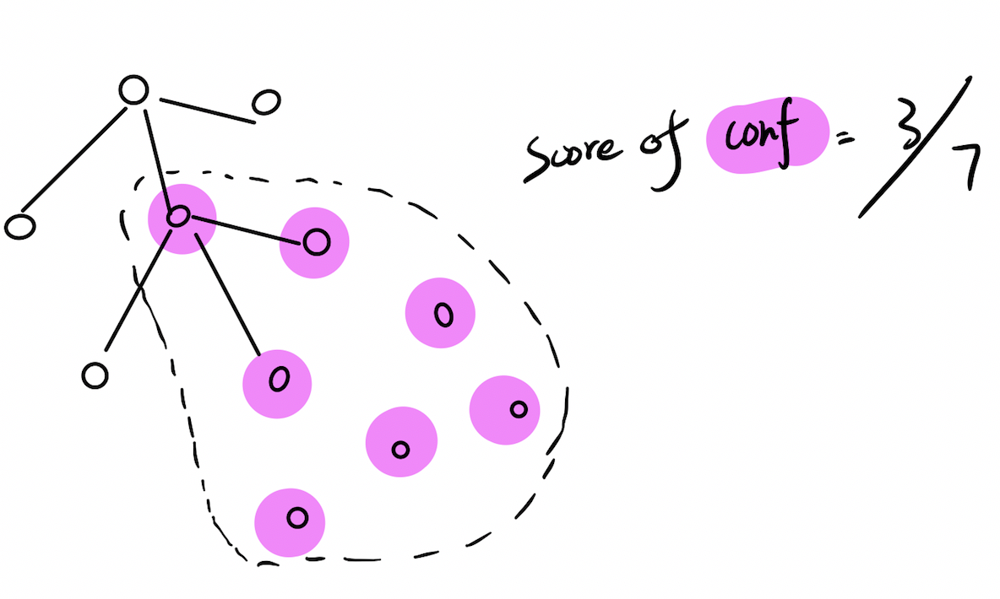

# Domain Transition Detection

Detect and visulize the domain changes occur around SIGIR conference

## Algorithm Explaination

The final goal of this algorithm is to compute the 2D embedding of the papers points around SIGIR conference. To accomplish this, we need to construct a reference graph  and use largeVis to compute the graph embedding in two-dimensional space.

1. Treat each paper in [Aminer](https://aminer.org/open-academic-graph) as a point, two paper are connected with a directed edge if one cites another.

2. BFS the graph starting from all papers belong to SIGIR, which create a subset of all paper points. The set of paper nodes is denoted as . We then construct all the conference that  has touched, which is to say .

3. Since that this may introduce too much possible conferences around SIGIR, like if only one paper in  belongs Nature, we still need to include Nature in . So we need to continue on filtering out more conferences in  by introducing an important score of each conference. The score of conference  is computed as . The intuition is simple, if the points in  that BFS can touch is not enough, we then consider this conference as irrelevent to the SIGIR.

4. 

